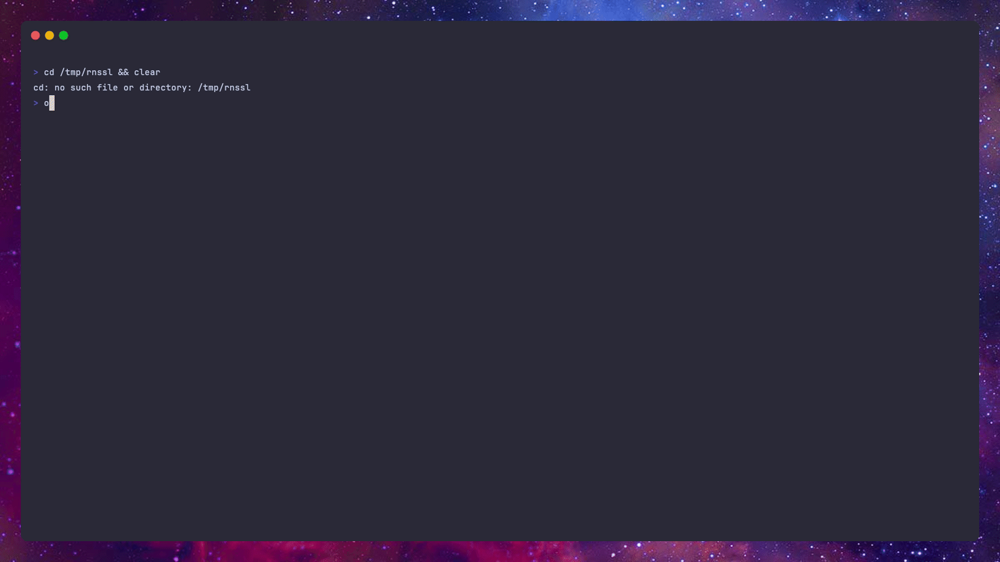
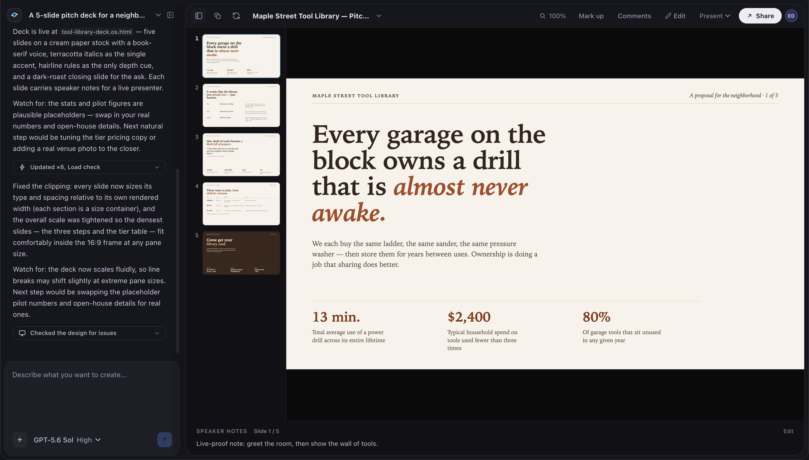

<div align="center">




### _a shell for the reversed world._
Terminal coding agent for Anthropic, Codex, Antigravity, xAI, Kimi, DeepSeek, MiniMax, GLM (Z.AI), and self-hosted LLMs.

**Privacy. Control. Provider choice.**

<a href="https://apps.apple.com/app/id6769261609"></a>
<a href="https://play.google.com/store/apps/details?id=dunamis.otherside"></a>

[**Overview**](#overview) · [**Ahead of the curve**](#ahead-of-the-curve) · [**Multiprovider orchestration**](#multiprovider-orchestration) · [**Design**](#design) · [**Features**](#features) · [**Install**](#installation) · [**Build**](#build-from-source) · [**Operation**](#operation) · [**Providers**](#providers) · [**Contributing**](#contributing)

</div>

> [!WARNING]
> **Pre-release software.** Otherside is under active development. Expect bugs, rough edges, and breaking changes.

> [!IMPORTANT]
> **Otherside is being rebuilt in Go.** The next generation of this CLI is a ground-up Go implementation, currently in development. This TypeScript client remains the production client until the cutover and keeps receiving maintenance fixes.

## Overview

Otherside is an open-source terminal coding agent that runs entirely on your terms. Built as a single-executable Bun binary, it supports rich interactive workflows, terminal UI pairing, and automated script runs.

With native support for top-tier AI providers and local models, Otherside allows you to orchestrate multiple LLMs within the same session. It serves as a multiprovider alternative to Claude Code, capable of running any LLM, either individually or orchestrated together, giving you full control over your data with zero telemetry.

## Coming next

- **Go Rebuild**: Rebuilding the entire CLI in Go, focused on native performance, minimal memory (RAM), and CPU use.
- **Feudalism orchestration**: Replacing the current three-tier preview with four fixed capability classes—`emperor`, `shogun`, `daimyo`, and `samurai`—and one rank-ordered model roster.
- **UI polish and bug fixes**: Continuing maintenance of this TypeScript client until the Go transition is complete (see [**Known Bugs**](#known-bugs)).

## Multiprovider orchestration

> **Multiprovider is in preview.** It is disabled by default and can be enabled through `/config` or `/multiprovider`. The current release uses the three-tier router below; Feudalism is the planned replacement and is not active yet.

Most agent CLIs delegate every subtask to the same model family. Otherside can route delegated Agent and Workflow work across eligible providers, while keeping the concrete provider and model visible.

Current capability tiers:

- **general**: deep reasoning for planning, synthesis, and final review;
- **warrior**: capable execution for implementation, debugging, and iterative tool work;
- **scout**: inexpensive fan-out for searches, inventories, and mechanical sweeps.

Current tier rosters, in routing priority order:

| Tier | Models |
|---|---|
| **general** | `gpt-5.6-sol` · `claude-fable-5` · `claude-opus-4-8` · `grok-4.5` · `glm-5.2` · `gemini-3.1-pro-high` |
| **warrior** | `gemini-3-flash` · `gpt-5.6-terra` · `claude-sonnet-5` · `grok-composer-2.5-fast` · `glm-5-turbo` · `deepseek-v4-flash` · `kimi-for-coding` · `minimax-m3` |
| **scout** | `gemini-3-flash-medium` · `grok-composer-2.5-fast` · `gpt-5.6-luna` · `claude-haiku-4-5` · `glm-5-turbo` |

Routing rules:

- Candidates are checked against credentials, quota, cooldowns, and runtime availability on every allocation.
- A named agent without an explicit tier is inferred from intent; explicit `provider` + `model` pins take precedence over tier routing.
- Workflow `diversify: true` can spread independent calls across distinct eligible providers in one tier.
- `/parallel`, `/fork`, and `/workflows` provide direct control over concurrent and deterministic delegated work.
- Rosters ship with releases and are never fetched or customized at runtime.

## Design

Otherside ships a design studio: run `/design` in the TUI and pair the session with [design.othersidecli.com](https://design.othersidecli.com) in your browser. The design agent authors interactive HTML artifacts (components, slide decks, prototypes, and mockups) rendered in a live preview as it works.

<div align="center">

</div>

- **Live authoring**: the agent writes and edits design files; the preview updates in real time, streamed from your local session.
- **Tweak controls**: designs can expose typed controls (colors, spacing, copy, options) you can adjust instantly in the browser with no model round-trip; reset or save your changes as new defaults.
- **Visual verification**: after substantive changes the agent verifies its own output with programmatic checks and screenshots before handing back.
- **Local-first**: designs are created and stored on your machine; the browser is a paired viewport, and the coding agent can read saved designs back with the `ReadDesign` tool.

Design uses the same provider you are signed into, with no separate subscription or key.

## Features

| | |
| --- | --- |
| **Native toolset** | Built-in shell, search, web, read, edit, write, image-generation, and image-parsing tools for codebases. |
| **Provider choice** | Anthropic, Codex, Antigravity, xAI, Kimi, DeepSeek, MiniMax, GLM (Z.AI), and OpenAI-compatible endpoints, including local models. |
| **Accessible terminal UI** | Keyboard-first interface designed for screen readers, low-bandwidth links, and high-latency connections. |
| **Mobile companion** | Pair an iOS or Android app over an end-to-end encrypted channel to follow sessions, read logs, and respond remotely. |
| **Goal-driven execution** | Use `/goal` to set success criteria and continue work across compaction until the result is met and approved. |
| **Deterministic workflows** | Coordinate subagents with JavaScript workflows, including parallel, pipeline, and nested runs; manage them with `/workflows`. |
| **Planning and side questions** | `/ultraplan` coordinates multi-agent planning; `/btw` keeps secondary questions out of the main thread. |
| **Background work** | Manage long-running tasks with `/tasks` and shell sessions with `/bashes`. |
| **Sessions and checkpoints** | Resume saved sessions and restore code or conversation history with `/rewind`. |
| **MCP and plugins** | Connect external tools through MCP (`/mcp`) and manage extensions with `/plugins`. |
| **Images** | Generate images through Codex; `ParseImage` and `Read` can route images through a configurable vision provider. |
| **Project memory and usage** | `/dream` stores project memory; `/usage` shows provider usage and available account information. |
| **Data control** | No product analytics or background tracking. Your code goes from your machine to the provider you choose. |
| **Single binary** | Install and run one executable; no Bun, Node, or source checkout is needed for released binaries. |

## Installation

Install uses the published release binary. You do not need Bun, Node, or a source checkout.

### macOS

```bash
curl -fsSL https://othersidecli.com/install.sh | bash
```

- Supports Apple Silicon and Intel Macs.
- Installs `otherside` to `~/.local/bin` by default.
- If the command is not found after install, add this to `~/.zshrc` or `~/.bashrc`:

```bash
export PATH="$HOME/.local/bin:$PATH"
```

### Linux

```bash
curl -fsSL https://othersidecli.com/install.sh | bash
```

- Supports x64 and arm64 Linux.
- Requires `curl`, `uname`, `mkdir`, and `install`.
- Verifies the release checksum when `sha256sum` or `shasum` is available.
- If `~/.local/bin` is not on your `PATH`, add it to your shell rc:

```bash
export PATH="$HOME/.local/bin:$PATH"
```

### Windows

Run in PowerShell:

```powershell
irm https://othersidecli.com/install.ps1 | iex
```

- Supports 64-bit Windows x64.
- Installs `otherside.exe` to `%LOCALAPPDATA%\Programs\otherside`.
- Adds the install directory to the user `Path`; restart PowerShell, Windows Terminal, or your IDE terminal after install.
- Git for Windows is recommended so shell commands can use Git Bash semantics when needed.

### Install options

Pin a release:

```bash
OTHERSIDE_VERSION=v0.9.0-pre bash -c "$(curl -fsSL https://othersidecli.com/install.sh)"
```

```powershell
$env:OTHERSIDE_VERSION = "v0.9.0-pre"
irm https://othersidecli.com/install.ps1 | iex
```

Install somewhere else:

```bash
OTHERSIDE_INSTALL_DIR=/usr/local/bin bash -c "$(curl -fsSL https://othersidecli.com/install.sh)"
```

```powershell
$env:OTHERSIDE_INSTALL_DIR = "$env:USERPROFILE\bin"
irm https://othersidecli.com/install.ps1 | iex
```

### Verify and launch

```bash
otherside --version
otherside
```

First run walks you through provider login.

## Build from source

Build from source is for contributors or local changes. It requires Bun 1.3.14+ and creates a local binary from your checkout.

```bash
git clone https://github.com/daanielcruz/otherside-cli.git
cd otherside-cli
bun install --frozen-lockfile
bun run build
./dist/otherside --version
```

`bun run build` writes `./dist/otherside` for the current configured target. The repository default targets macOS arm64 because local development happens there; releases are cross-built by CI for macOS, Linux, and Windows.

To install your locally built binary on macOS or Linux:

```bash
mkdir -p "$HOME/.local/bin"
cp ./dist/otherside "$HOME/.local/bin/otherside"
chmod +x "$HOME/.local/bin/otherside"
```

Or use the helper:

```bash
bun run build:install
```

On Windows, build with an explicit Windows target and copy the executable to your chosen install directory:

```powershell
bun build --compile --target=bun-windows-x64 --outfile=dist/otherside.exe src/main.ts
$InstallDir = "$env:LOCALAPPDATA\Programs\otherside"
New-Item -ItemType Directory -Force -Path $InstallDir | Out-Null
Copy-Item .\dist\otherside.exe "$InstallDir\otherside.exe" -Force
```

Contributor checks:

```bash
bun run typecheck
bun run lint
bun run test
```

## Operation

Three modes share the same harness.

```bash
# Interactive TUI (default)
otherside

# Resume a saved session for the current project
otherside --resume <session-id>
otherside -c   # most recent session in this cwd

# One-shot run (scripts, CI, cron)
otherside -p "refactor the session loader to use the shared path helper"

# Pipe stdin
cat logs.txt | otherside -p "find the stack trace that caused the segfault"

# Skip every permission prompt
otherside --yolo
```

## Providers

Each provider has its own authentication, tool adaptation, and model catalog behind one interface.

```bash
otherside --provider deepseek
otherside --provider codex --model gpt-5.5
otherside --provider openai-custom --model <your-model>
```

| Provider | Slug | Auth | Default model | Notes |
|---|---|---|---|---|
| Anthropic | `anthropic` | OAuth | `claude-opus-4-8` | Subscription usage and web search. |
| Codex | `codex` | OAuth | `gpt-5.6-sol` | GPT-5.x models and hosted image generation. |
| Antigravity | `antigravity` | OAuth | `gemini-3-flash` | Google account path; Gemini, Claude, and GPT-OSS models. |
| xAI | `xai` | OAuth | `grok-4.5` | Grok models through SuperGrok OAuth. |
| Kimi | `kimi-code` | API key | `kimi-for-coding` | K2.7 Code and usage limits in `/usage`. |
| DeepSeek | `deepseek` | API key | `deepseek-v4-pro` | V4 Pro and Flash; configurable vision side-channel. |
| MiniMax | `minimax` | API key | `minimax-m2.7` | M2.7 and M3 models. |
| GLM (Z.AI) | `glm` | OAuth | `glm-5.2` | GLM-5.2 and GLM-5-Turbo; native web search. |
| OpenAI Custom | `openai-custom` | API key | (set your own) | Any OpenAI-compatible endpoint, including local runtimes. |

From the interactive TUI, sign in or out with:

```text
/login [provider]
/logout [provider]
```

`openai-custom` works with any OpenAI-compatible endpoint: LM Studio, llama.cpp, vLLM, Hugging Face TGI, or any self-hosted runtime.

### Important: Antigravity

Using `antigravity` through a third-party client may violate Google's Terms of Service.

## Known bugs

Feel free to open issues or send feedback. Key unresolved issues include:

- **Memory buildup**: Certain long-running sessions experience increased memory usage without timely cleanup (totally fixed in Go version).
- **Parallel forks**: Subagent forks can execute erratically during sessions with high parallel agent counts (being fixed).
- **UI glitches**: Minor layout issues like panel breakage or erratic scrolling may occur during active LLM streaming (being fixed).
- **Temporary files**: Excessive temporary files can accumulate over time without being deleted (being fixed).
- **Plugins market**: The plugin marketplace is not working as expected (being fixed).

Since we are in an accelerated development process, many breakages can be expected. For security details and reporting, see our [**Security Policy**](https://github.com/daanielcruz/otherside-cli/security).

## Contributing

TypeScript + Bun. PRs welcome.

Note that the project is being rebuilt in Go; this TypeScript codebase is in maintenance mode, so bug fixes are the most valuable contributions here.

See [Build from source](#build-from-source) for setup and local build commands. Requires Bun 1.3.14+.
